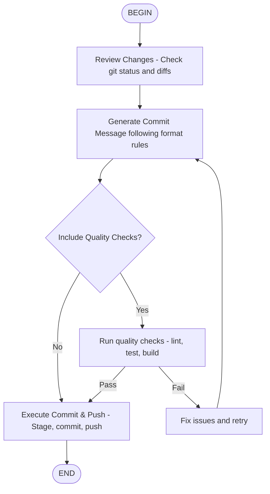

# Commit & Push Skill

Automates Git commit and push operations with quality checks and proper commit message formatting.



## Description

This skill provides automated Git commit and push functionality for the current branch. It follows the repository's commit message format rules defined in `.windsurf/rules/commit-message-format.md` and ensures proper staging, committing, and pushing of changes.

## Prerequisites

- Changed files exist in the working directory
- Git repository initialized with remote `origin` configured
- Appropriate Git credentials configured for push operations

## Skill Usage

When this skill is active, you can use it to:
1. Stage all changes (`git add -A`)
2. Commit with properly formatted message
3. Push to the current branch on remote `origin`
4. Optionally run quality checks before committing

## Workflow Steps

### 1. Review Changes
Before committing, review the changes using:
```bash
git status
git diff --cached  # for staged changes
git diff           # for unstaged changes
```

### 2. Generate Commit Message
Generate a commit message following the format:
```
<Prefix>: <Summary (imperative/concise)>

- Change 1 (bullet point)
- Change 2 (bullet point)
- ...

Refs: #<Issue number> (optional)
```

**Allowed Prefixes:**
- `feat`: Add new feature
- `fix`: Bug fix
- `refactor`: Refactoring (no behavior change)
- `perf`: Performance improvement
- `test`: Add/modify tests
- `docs`: Documentation update
- `build`: Build/dependency changes
- `ci`: CI-related changes
- `chore`: Miscellaneous tasks
- `style`: Style-only changes
- `revert`: Revert

### 3. Execute Commit & Push
Use the Shell tool to execute the Git operations:

#### A. Safe Batch Execution (Recommended)
```bash
MSG="<Prefix>: <Summary>" \
BRANCH=$(git branch --show-current) && \
git add -A && \
git commit -m "$MSG" && \
git push -u origin "$BRANCH"
```

#### B. Step Execution (For Debugging)
```bash
# Get current branch
BRANCH=$(git branch --show-current)

# Stage changes
git add -A

# Commit with message
git commit -m "<Prefix>: <Summary>"

# Push to remote
git push -u origin "$BRANCH"
```

### 4. Optional Quality Checks
You can add quality checks before committing:
```bash
# Example quality checks aligned with this repository
./run_tests.sh -u || exit 1
```

## Kimi Code CLI Tools Used

- **execute_command**: Execute Git commands and quality checks
- **read_file**: Read commit message format rules from `.windsurf/rules/commit-message-format.md`
- **list_files** or **execute_command**: Check for changed files (`git status`)

## Examples

### Example 1: Simple Fix
```bash
MSG="fix: Remove unnecessary debug log output" \
BRANCH=$(git branch --show-current) && \
git add -A && \
git commit -m "$MSG" && \
git push -u origin "$BRANCH"
```

### Example 2: Feature Addition
```bash
MSG="feat: Add user preference validation" \
BRANCH=$(git branch --show-current) && \
git add -A && \
git commit -m "$MSG" && \
git push -u origin "$BRANCH"
```

### Example 3: With Quality Checks
```bash
MSG="refactor: Consolidate duplicate validation logic" \
BRANCH=$(git branch --show-current) && \
# Run quality checks
./run_tests.sh -u || exit 1
# Proceed with commit
git add -A && \
git commit -m "$MSG" && \
git push -u origin "$BRANCH"
```

## Best Practices

1. **Always review diffs** before committing using `git diff` or `git diff --cached`
2. **Follow the commit message format** strictly as per `.windsurf/rules/commit-message-format.md`
3. **Keep commits focused** - each commit should represent a single logical change
4. **Test before committing** when possible
5. **Use descriptive messages** that explain the "why" not just the "what"

## Error Handling

- If there are no changes to commit, Git will exit with an error
- If push fails (e.g., due to authentication or conflicts), check remote configuration
- If quality checks fail, fix issues before proceeding with commit

## Integration with Other Skills

This skill can be combined with:
- **Testing skills** to run tests before commit
- **Linting skills** to ensure code quality
- **Build skills** to verify build success

## Notes

- This skill follows the commit message format rules defined in `.windsurf/rules/commit-message-format.md`
- Always verify the current branch before pushing
- Use `-u` flag with `git push` to set upstream tracking for new branches
- For security, ensure Git credentials are properly configured

## Reference

- [Conventional Commits](https://www.conventionalcommits.org/)
- `.windsurf/rules/commit-message-format.md` - Project-specific commit format rules
- `.windsurf/workflows/commit-push.md` - Original Windsurf workflow

## Version History

- **1.0.0**: Initial release based on Windsurf commit-push workflow