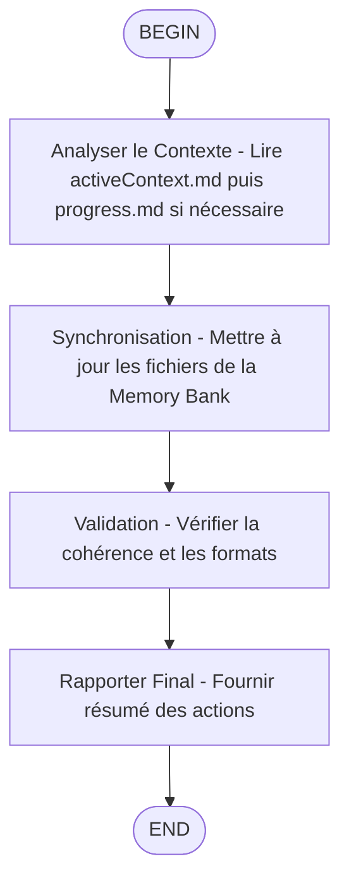

# End Skill - Terminer la Session et Synchroniser la Memory Bank

## Description

Ce skill implémente le workflow `/end` pour terminer proprement une session de développement et synchroniser la Memory Bank selon les règles du projet render_signal_server.



## Capabilities

- Charger et analyser le contexte de session actif
- Mettre à jour la Memory Bank selon le protocole du projet
- Synchroniser uniquement les fichiers Memory Bank réellement impactés (`activeContext.md`, `progress.md`, puis `productContext.md`, `systemPatterns.md` ou `decisionLog.md` seulement si nécessaire)
- Fournir un résumé de session complet
- Assurer la transition vers un état neutre de la Memory Bank

## Instructions Opérationnelles

### 1. Charger le Contexte de Session

Utiliser les outils `fast-filesystem` pour lire les fichiers pertinents de la Memory Bank :

```javascript
// Lire le contexte actif puis le progrès seulement si nécessaire
const activeContext = await fast_read_file('/home/kidpixel/render_signal_server-main/memory-bank/activeContext.md');
const progress = await fast_read_file('/home/kidpixel/render_signal_server-main/memory-bank/progress.md');
```

**Note Importante** : Lisez `progress.md` seulement si l'état de la session l'exige. Ne lisez PAS `productContext.md`, `systemPatterns.md` ou `decisionLog.md` sauf si une décision architecturale majeure ou un changement produit le justifie.

### 2. Exécuter le Protocole Memory Bank

Suivre les règles définies dans `.clinerules/memorybankprotocol.md` :

1. **Suspendre la tâche en cours** puis résumer la session
2. **Utiliser `search`** pour identifier les fichiers additionnels à consulter (ex: documents liés à la session)
3. **Résumer les activités** de la session avec précision

### 3. Mettre à Jour la Memory Bank

- Mettre à jour les fichiers après lecture sélective et seulement si le protocole impose réellement une synchronisation :

```javascript
// Avant chaque modification, lire la section pertinente pour minimiser les changements
const sectionToUpdate = await fast_read_file('/home/kidpixel/render_signal_server-main/memory-bank/activeContext.md');

// Mettre à jour seulement les fichiers impactés
await fast_write_file('/home/kidpixel/render_signal_server-main/memory-bank/activeContext.md', updatedContent);
```

**Instructions de Verrouillage** : Utilisez EXCLUSIVEMENT les outils `fast-filesystem` (`fast_read_file`, `fast_write_file`, etc.) pour accéder aux fichiers memory-bank avec des chemins absolus.

### 4. Clôturer la Session

1. **Résumer les tâches finalisées** dans la réponse utilisateur
2. **Vérifier avec `fast_read_file`** que :
   - `progress.md` indique "Aucune tâche active"
   - `activeContext.md` est revenu à l'état neutre
3. **Fournir un récapitulatif** des modifications effectuées dans la Memory Bank

## Workflow Détaillé

### Étape 1 : Analyse du Contexte
- Lire `activeContext.md` pour comprendre l'état actuel de la session
- Lire `progress.md` seulement si `activeContext.md` ne suffit pas à déterminer l'état de la session
- Identifier les changements significatifs nécessitant une documentation

### Étape 2 : Synchronisation
- Mettre à jour `decisionLog.md` seulement si des décisions importantes ont été prises
- Actualiser `systemPatterns.md` seulement si des patterns nouveaux ont émergé
- Réviser `productContext.md` seulement si le contexte produit a évolué
- Réinitialiser `activeContext.md` à l'état neutre si la session est réellement clôturée
- Mettre `progress.md` à "Aucune tâche active" uniquement si une tâche était encore ouverte

### Étape 3 : Validation
- Vérifier que tous les fichiers sont correctement formatés
- S'assurer que les chemins absolus sont utilisés pour toutes les opérations
- Confirmer que le protocole a été respecté dans son intégralité

### Étape 4 : Rapport Final
- Fournir un résumé des actions entreprises
- Lister les fichiers modifiés
- Indiquer l'état final de la Memory Bank

## Outils Requis

### MCP fast-filesystem
- `fast_read_file` : Pour lire les fichiers de la Memory Bank
- `fast_write_file` : Pour mettre à jour les fichiers
- `fast_search_files` : Pour trouver des fichiers supplémentaires pertinents

### Outils Kimi Code CLI Standards
- `ReadFile` / `WriteFile` : Pour les fichiers en dehors de la Memory Bank si nécessaire
- `Grep` / `SearchWeb` : Pour la recherche de documentation supplémentaire

## Fichiers de Référence Obligatoires

- `/home/kidpixel/render_signal_server-main/.clinerules/memorybankprotocol.md`
- `/home/kidpixel/render_signal_server-main/memory-bank/activeContext.md`
- `/home/kidpixel/render_signal_server-main/memory-bank/progress.md`
- `/home/kidpixel/render_signal_server-main/memory-bank/productContext.md` (si nécessaire)
- `/home/kidpixel/render_signal_server-main/memory-bank/systemPatterns.md` (si nécessaire)
- `/home/kidpixel/render_signal_server-main/memory-bank/decisionLog.md` (si nécessaire)

## Exceptions et Cas Particuliers

### Session avec Décisions Architecturales Majeures
Si la session a impliqué des décisions architecturales significatives :
1. Lire `decisionLog.md` en entier
2. Documenter la décision avec contexte complet
3. Mettre à jour `systemPatterns.md` si un nouveau pattern a été établi

### Session avec Contexte Produit Modifié
Si le contexte produit a évolué :
1. Lire `productContext.md` en entier
2. Mettre à jour les sections pertinentes
3. Conserver l'historique des changements

### Session Courte sans Changements Significatifs
Pour les sessions courtes sans impact majeur :
1. Mettre uniquement à jour `activeContext.md` et `progress.md` si une synchronisation est requise
2. Ignorer les autres fichiers sauf indication contraire

## Validation de la Sortie

Après exécution du skill, vérifier que :

1. **Tous les fichiers** sont dans un état cohérent
2. **Les chemins absolus** ont été utilisés pour toutes les opérations
3. **Le protocole** a été respecté
4. **Le résumé** est complet et précis
5. **L'état final** est "Aucune tâche active" et contexte neutre

## Notes d'Implémentation

- Toujours utiliser des chemins absolus pour les fichiers memory-bank
- Minimiser les lectures/écritures en lisant d'abord, puis en écrivant
- Respecter la structure Markdown existante des fichiers
- Documenter les décisions avec date, contexte et justification
- Maintenir la cohérence avec les règles du projet render_signal_server