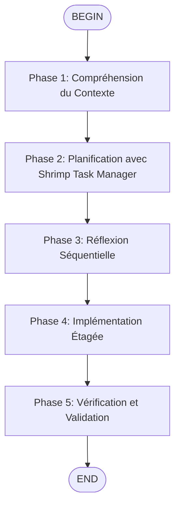

# Enhance Complex - Architecture Complexe avec Shrimp Task Manager

## Description

Ce skill permet de transformer des demandes techniques complexes en stratégies d'exécution structurées utilisant le Shrimp Task Manager MCP intégré dans Kimi Code CLI.



**Utilisez ce skill lorsque :**
- Vous devez planifier une implémentation complexe avec de multiples composants
- Vous avez besoin de décomposer une tâche grande en sous-tâches gérables
- Vous devez orchestrer des dépendances entre différentes parties du système
- Vous avez besoin d'une analyse technique approfondie avant l'implémentation

## Outils MCP Disponibles dans Kimi Code CLI

Ce skill utilise les outils MCP du serveur `shrimp-task-manager` qui sont déjà disponibles dans Kimi Code CLI :

- **Planification** : `plan_task`, `analyze_task`, `reflect_task`
- **Décomposition** : `split_tasks`, `list_tasks`, `execute_task`
- **Vérification** : `verify_task`, `delete_task`, `clear_all_tasks`
- **Gestion** : `update_task`, `query_task`, `get_task_detail`
- **Réflexion** : `process_thought`, `init_project_rules`, `research_mode`

## Processus de Travail

### Phase 1 : Compréhension du Contexte
1. **Lire le contexte actif** : Utiliser `fast_read_file` sur `/home/kidpixel/render_signal_server-main/memory-bank/activeContext.md` pour comprendre le contexte global du repository
2. **Analyser l'état actuel** : Vérifier les tâches existantes avec `list_tasks` pour éviter les conflits
3. **Identifier les contraintes** : Consulter les fichiers de règles du projet (`/.clinerules/`)

### Phase 2 : Planification avec Shrimp Task Manager
1. **Créer le brief détaillé** : Documenter les exigences, contraintes techniques et résultats attendus
2. **Analyser la faisabilité** : Utiliser `plan_task` avec description détaillée et exigences spécifiques
3. **Décomposer en sous-tâches** : Utiliser `split_tasks` pour diviser la tâche principale en unités indépendantes avec dépendances claires
4. **Évaluer les risques** : Utiliser `analyze_task` pour identifier les défis techniques et les points de blocage potentiels

### Phase 3 : Réflexion Séquentielle
1. **Valider la logique étape par étape** : Utiliser `sequentialthinking_tools` (du serveur MCP `sequential-thinking`) avant chaque étape majeure
2. **Cartographier les dépendances** : Identifier les relations entre les composants du système
3. **Anticiper les problèmes** : Valider les risques potentiels et préparer des plans de contournement

### Phase 4 : Implémentation Étagée
1. **Configurer l'environnement** : Préparer les dépendances et la structure de base nécessaires
2. **Suivre le plan généré** : Exécuter les sous-tâches dans l'ordre défini par les dépendances
3. **Guider l'exécution** : Utiliser `execute_task` pour chaque sous-tâche avec instructions spécifiques
4. **Tester itérativement** : Valider chaque sous-tâche avant de passer à la suivante

### Phase 5 : Vérification et Validation
1. **Vérifier structurellement** : Utiliser les outils `json-query` disponibles (`json_query_query_json`, `json_query_search_keys`, `json_query_search_values`) pour valider les modifications de configuration
2. **Scorer les résultats** : Utiliser `verify_task` pour évaluer chaque tâche complétée selon des critères définis
3. **Assurer la couverture** : Valider que tous les tests passent avant de continuer
4. **Réfléchir aux optimisations** : Utiliser `reflect_task` pour analyser les résultats et identifier des améliorations
5. **Documenter les changements** : Mettre à jour la documentation technique et les AGENTS.md pertinents

## Templates d'Utilisation

### Template pour Tâches Complexes

```javascript
{
  role: 'Senior Technical Architect',
  expertise: [
    'Shrimp Task Manager orchestration',
    'Complex system decomposition',
    'Technical risk assessment',
    'Dependency management'
  ],
  task: 'Plan and execute complex architectural changes',
  mcpTools: [
    'plan_task',
    'analyze_task', 
    'split_tasks',
    'execute_task',
    'verify_task',
    'reflect_task'
  ],
  process: [
    '1. Read activeContext.md',
    '2. Plan task with detailed requirements',
    '3. Analyze technical feasibility',
    '4. Split into manageable subtasks',
    '5. Execute with guided instructions',
    '6. Verify each component',
    '7. Reflect on optimizations'
  ],
  outputFormat: 'Structured task plan with dependencies, validation criteria, and risk assessment'
}
```

### Template pour Analyse Technique

```javascript
{
  role: 'Technical Analyst',
  expertise: [
    'System architecture analysis',
    'Risk identification',
    'Technical feasibility assessment'
  ],
  task: 'Analyze complex technical requirements',
  analysisSteps: [
    'Review existing codebase structure',
    'Identify integration points',
    'Assess performance implications',
    'Evaluate security considerations',
    'Check compatibility constraints'
  ],
  outputFormat: 'Technical analysis report with risk matrix and implementation recommendations'
}
```

## Conventions de Nommage pour les Tâches

- **Niveau 1** : Modules fonctionnels (ex: `auth-module`, `api-gateway`)
- **Niveau 2** : Processus principaux (ex: `user-authentication-flow`, `data-pipeline-setup`)
- **Niveau 3** : Étapes clés (ex: `configure-oauth-provider`, `implement-rate-limiting`)

## Validation et Qualité

### Critères de Validation
1. **Conformité aux exigences (30%)** : Complétude fonctionnelle, respect des contraintes, gestion des cas limites
2. **Qualité technique (30%)** : Cohérence architecturale, robustesse du code, élégance de l'implémentation
3. **Compatibilité d'intégration (20%)** : Intégration système, interopérabilité, maintien de la compatibilité
4. **Performance et évolutivité (20%)** : Optimisation des performances, adaptation à la charge, gestion des ressources

### Scores et Décisions
- **≥ 80 points** : Tâche validée, peut passer à l'étape suivante
- **60-79 points** : Corrections mineures nécessaires avant validation
- **< 60 points** : Révision majeure requise, repenser l'approche

## Intégration avec le Projet Render Signal Server

Ce skill respecte les conventions spécifiques du projet :

- **Architecture Redis-first** : Toute configuration critique doit être gérée via Redis
- **Ingestion Gmail Push uniquement** : Ne pas réintroduire de polling IMAP
- **Dashboard ES6 modulaire** : Préserver la structure frontend existante
- **Sécurité des entrées** : Renforcer l'authentification sur les points d'entrée

## Références Obligatoires

Avant d'utiliser ce skill, consultez toujours :

- `/home/kidpixel/render_signal_server-main/.clinerules/codingstandards.md`
- `/home/kidpixel/render_signal_server-main/.clinerules/memorybankprotocol.md`
- `/home/kidpixel/render_signal_server-main/.clinerules/v5.md` (section "2. Tool Usage Policy for Coding")

## Exemple Complet d'Utilisation

### Scénario : Ajouter un nouveau système d'authentification

1. **Phase 1** : Lire `activeContext.md`, vérifier `list_tasks`
2. **Phase 2** : 
   - `plan_task` avec description détaillée du système d'authentification
   - `analyze_task` pour évaluer l'intégration avec l'existant
   - `split_tasks` en : [setup-oauth-providers, implement-magic-links, secure-webhook-auth]
3. **Phase 3** : `sequentialthinking_tools` pour valider chaque décision
4. **Phase 4** : `execute_task` sur chaque sous-tâche
5. **Phase 5** : `verify_task` sur chaque résultat, `reflect_task` sur l'ensemble

## Notes d'Implémentation

- **Minimiser les changements** : Toujours faire le minimum nécessaire pour atteindre l'objectif
- **Tester itérativement** : Valider chaque composant avant d'intégrer
- **Documenter les décisions** : Mettre à jour `memory-bank/` avec les choix architecturaux
- **Respecter le style existant** : Suivre les conventions de codage du projet

Ce skill transforme Kimi en architecte technique senior capable de décomposer, planifier et orchestrer les implémentations les plus complexes tout en respectant les contraintes spécifiques du projet.