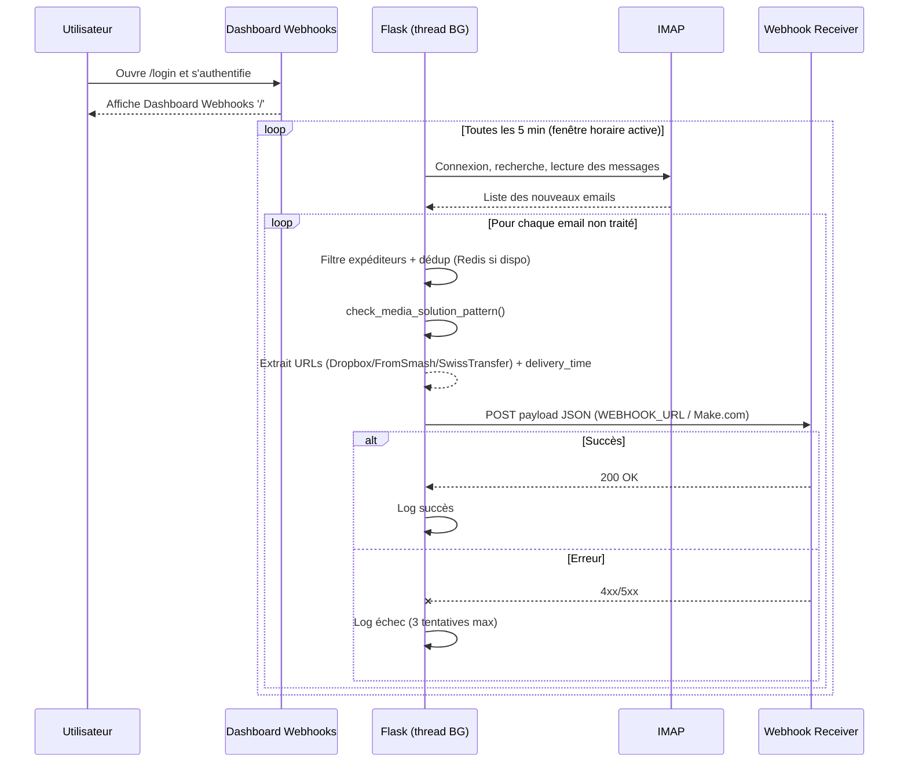

# Architecture

---

## 📅 Dernière mise à jour / Engagements Lot 2

**Date de refonte** : 2026-01-25 (protocol code-doc)

### Terminologie unifiée
- **`DASHBOARD_*`** : Variables d'environnement (anciennement `TRIGGER_PAGE_*`)
- **`MagicLinkService`** : Service singleton pour authentification sans mot de passe
- **`R2TransferService`** : Service singleton pour offload Cloudflare R2
- **"Absence Globale"** : Fonctionnalité de blocage configurable par jour de semaine

### Engagements Lot 2 (Résilience & Architecture)
- ✅ **Verrou distribué Redis** : Implémenté avec clé `render_signal:poller_lock`, TTL 5 min (legacy pour IMAP, conservé pour autres tâches critiques)
- ✅ **Fallback R2 garanti** : Conservation URLs sources si Worker R2 indisponible
- ✅ **Tests résilience** : `test_r2_resilience.py`, scénarios Redis pour routing/logs
- ✅ **Store-as-Source-of-Truth** : Configuration dynamique depuis Redis/fichier, pas d'écriture runtime dans les globals

### Complexity Watchlist (radon 2026-02-04)

| Domaine | Fonction critique | Grade | Actions réalisées / Plans |
| --- | --- | --- | --- |
| Orchestrateur Gmail Push | `email_processing/orchestrator.py::check_new_emails_and_trigger_webhook` | F (239) | ✅ Extraction routing rules. ⚠️ Besoin d’extraire davantage les branches Media Solution/DESABO pour réduire la complexité héritée du polling. |
| API Ingress Gmail | `routes/api_ingress.py::ingest_gmail` | F (85) | ✅ Endpoint Apps Script en production. ⚠️ Découpage par helpers (validation payload, fenêtre horaire, enrichissement R2) recommandé. |
| Service Offload R2 | `services/r2_transfer_service.py::normalize_source_url` | E (31) | ⚠️ Stratégie par fournisseur encore à implémenter pour supprimer les grosses branches conditionnelles. |
| Preferences Service | `preferences/processing_prefs.py::validate_processing_prefs` | E (32) | ⚠️ Migration vers Pydantic/Marshmallow à planifier pour formaliser le schéma. |
| Pattern Matching Media Solution | `email_processing/pattern_matching.py::check_media_solution_pattern` | E (33) | ⚠️ Extraction d’un moteur dédié (regex + heuristiques) suggérée. |
| Routing Rules Service | `services/routing_rules_service.py::_normalize_rules` | D (26) | ✅ Service stabilisé (validation + normalisation). |
| Magic Link Service | `services/magic_link_service.py::consume_token` | C (18) | ✅ Service stabilisé : gestion TTL, révocation, logs. |

> Ces surveillances garantissent que les sections « Services dédiés » ci-dessous restent alignées avec l’état réel du code; toute réduction de complexité doit être documentée ici.

### Métriques de documentation
- **Volume** : 7 388 lignes de contenu réparties dans 54 fichiers actifs (+6 nouveaux)
- **Code source** : 388k lignes Python (1668 fichiers) + 62k lignes JavaScript (302 fichiers)
- **Complexité moyenne** : D (24.9) avec 44 blocs analysés par radon
- **Densité** : Justifie le découpage modulaire pour maintenir la lisibilité
- **Exclusions** : `archive/` et `audits/` maintenus séparément pour éviter le bruit
- **Nouveautés** : Documentation dropdowns, métriques, Redis logs, verrouillage routing, scroll UI, CSS modulaire

---

Cette application fournit une télécommande web sécurisée (Flask + Flask-Login) et un service d'ingestion d'e-mails via Gmail Push.

## Vue d'ensemble

- **Backend orienté services** : les responsabilités de configuration, d'authentification, de flags runtime, de webhooks et de déduplication sont encapsulées dans des services dédiés (voir ci‑dessous et `services/`).
- **Traitement des e‑mails** : orchestré par `email_processing/orchestrator.py` (déduplication, détection des motifs, envoi des webhooks). Les détails métier sont approfondis dans `docs/features/gmail_push_ingress.md` et `docs/webhooks.md`. **Ingress Gmail unique** : endpoint `POST /api/ingress/gmail` est le seul mécanisme d'ingestion (voir `docs/features/gmail_push_ingress.md`).
- **Routes Flask** : organisées en blueprints dans `routes/` (API config, admin, logs, webhooks, test, utilitaires, dashboard, health), consommant directement les services.
- **Configuration et stockage** : centralisés dans `config/` et `config/app_config_store.py` avec backend JSON externe + fallback fichiers (`debug/*.json`). Voir `docs/configuration.md` et `docs/storage.md`.
- **Aspects transverses** :
  - UI Dashboard Webhooks : `docs/features/frontend_dashboard_features.md` (architecture ES6 modulaire, CSS modulaire, UX avancée)
  - Sécurité : `docs/securite.md`
  - Exploitation Render / monitoring : `docs/operational-guide.md`
  - Stratégie de tests : `docs/testing.md`

## Structure modulaire (refactor 2025-10)

### Architecture orientée services (2025-11-17)

- Services dédiés par responsabilité pour encapsuler la logique métier et la configuration.
- Singletons avec cache mémoire (TTL 60s) pour limiter les lectures disque et invalider automatiquement lors des mises à jour.
- Intégration côté routes: les blueprints consomment les services (imports `services.*`) au lieu d’accéder directement aux modules globaux.
- Centralisation des validations/normalisations (ex: URLs HTTPS + normalisation Make.com dans `WebhookConfigService`).

| Service | Module | Responsabilités clés |
| --- | --- | --- |
| `ConfigService` | `services/config_service.py` | Agrège `config.settings`, expose validations d’email, URL Render et helpers d’injection dans `app_render.py` @app_render.py#129-154 |
| `AuthService` | `services/auth_service.py` | Initialise Flask-Login, fournit les helpers d’authentification (sessions dashboard + API) @app_render.py#137-185 |
| `RuntimeFlagsService` (Singleton) | `services/runtime_flags_service.py` | Charge/persiste `runtime_flags.json`, applique cache TTL=60 s, protège les écritures via `RLock` + fichiers temporaires (`os.replace`) et expose `get_all_flags()` / `update_flags()` @routes/api_config.py#27-158 |
| `WebhookConfigService` (Singleton) | `services/webhook_config_service.py` | Gère la config webhook (validation HTTPS forcée, normalisation Make.com, cache + store externe `app_config_store`, RLock + écritures atomiques + fsync) @app_render.py#299-310 |
| `DeduplicationService` | `services/deduplication_service.py` | Orchestration du dedup email/subject (Redis + fallback mémoire) utilisée par Gmail Push @app_render.py#425-437 |
| `RoutingRulesService` (Singleton) | `services/routing_rules_service.py` | Moteur de routage dynamique (Redis-first, validation/normalisation, cache TTL) avec API `/api/routing_rules` et intégration orchestrateur @services/routing_rules_service.py#66-143 |
| `R2TransferService` (Singleton) | `services/r2_transfer_service.py` | Offload Cloudflare R2 (normalisation Dropbox, fetch distant signé `X-R2-FETCH-TOKEN`, persistance des paires `source_url`/`r2_url` + `original_filename`) @email_processing/orchestrator.py#645-711 |
| `MagicLinkService` (Singleton) | `services/magic_link_service.py` | Génération/validation de magic links signés HMAC, TTL configurable, stockage JSON verrouillé, expose l’endpoint `/api/auth/magic-link` @routes/api_auth.py |

> Les anciens services liés au polling IMAP sont archivés; seule l’ingestion Gmail Push (Apps Script → `/api/ingress/gmail`) reste active.

Bootstrap `app_render.py` (ordre d'initialisation, simplifié):
- Initialisation `ConfigService` → `AuthService.init_flask_login()` (sessions dashboard & API) @app_render.py#129-185
- Enregistrement des blueprints (toutes les routes orientées services) @app_render.py#143-156
- Initialisation des Singletons (`RuntimeFlagsService`, `WebhookConfigService`) avec logs d’état et fallback externe @app_render.py#284-310
- Initialisation du `DeduplicationService` (Redis/Fallback) @app_render.py#425-437
- Initialisation de la fenêtre horaire (ENV → overrides UI via fichier/store) @app_render.py#324-332
- Initialisation conditionnelle de `R2TransferService` (variables `R2_FETCH_*`) et du stockage des tokens Magic Link (permissions disque vérifiées dès le boot) pour surfacer les erreurs de configuration avant le premier cycle opératoire.
- Observabilité: heartbeat périodique, handler SIGTERM, contrôles d’activation des threads (poller + watcher Make) @app_render.py#230-735

Orchestrateur (2025-11-18 → 2026-02-04): helpers module-level extraits (`_is_webhook_sending_enabled`, `_load_webhook_global_time_window`, `_fetch_and_parse_email`), `TypedDict ParsedEmail`, constantes `DETECTOR_*`, `ROUTE_*`, parsing plain+HTML @email_processing/orchestrator.py#26-188. Depuis la retraite IMAP, l’orchestrateur est alimenté exclusivement par Gmail Push (`/api/ingress/gmail`) et applique les mêmes garde-fous (déduplication, fenêtres horaires, routing dynamique).

Règles de fenêtre horaire (webhooks dédiés):
- DESABO non urgent: bypass hors fenêtre et envoi immédiat.
- DESABO urgent: ne contourne pas la fenêtre → skip hors fenêtre.
- RECADRAGE hors fenêtre: skip + marquage lu/traité (évite retrait à l’ouverture de fenêtre).

### Intégration Cloudflare R2 & Workers (2026-01-08)
### Flux Docker GHCR & Déploiement Render (2026-01-07)

- **Pipeline Docker** : Le `Dockerfile` racine construit une image avec Gunicorn, variables `GUNICORN_*` et logs stdout/stderr.
- **Workflow GitHub Actions** : `.github/workflows/render-image.yml` build l'image, la pousse sur GHCR (`ghcr.io/<owner>/<repo>:latest` + `:<sha>`), puis déclenche Render.
- **Déclenchement Render** : Priorité au Deploy Hook (`RENDER_DEPLOY_HOOK_URL`), puis API Render (`RENDER_API_KEY`, `RENDER_SERVICE_ID`), fallback manuel.
- **Avantages** : Temps de déploiement réduit, image pré-buildée, logs centralisés, URL de production `https://render-signal-server-latest.onrender.com`.


- **Service dédié** : `R2TransferService` (Singleton) encapsule la normalisation Dropbox, la génération des clés d’objets, l’appel au Worker Cloudflare (`X-R2-FETCH-TOKEN` obligatoire) et la persistance des paires `source_url`/`r2_url` (JSON verrouillé via `fcntl`).
- **Orchestrateur** : `email_processing/orchestrator.py` enrichit `delivery_links` si `R2_FETCH_ENABLED=true`, propage `original_filename` (extrait depuis `Content-Disposition`) et journalise les succès/échecs (`R2_TRANSFER:*`).
- **Workers Cloudflare** :
  - `deployment/cloudflare-worker/worker.js` – Fetch distant (timeout 30s / 120s pour `/scl/fo/`), validation HTML/ZIP, stockage R2 avec metadata (`expiresAt`, `originalFilename`).
  - `deployment/cloudflare-worker/cleanup.js` – Suppression automatique (24h) basée sur les metadatas.
- **Backends PHP** : `deployment/src/JsonLogger.php` a été étendu pour écrire les paires R2, les pages de test (`test.php`, `test-direct.php`) disposent d’un mode « Offload via Worker » avec diagnostics complets.
- **Garanties** : économies de bande passante Render (~$5/mois pour 50 GB), fallback gracieux (si l’offload échoue, le webhook conserve uniquement `raw_url`/`direct_url`).
### Résilience & Architecture (Lot 2, 2026-01-14)

#### Fallback R2 Garanti
- **Service** : `services/r2_transfer_service.py` avec gestion d'erreurs robuste
- **Comportement** : Conservation explicite de `raw_url` en cas d'échec d'offload
- **Logging** : `R2_TRANSFER:*` avec WARNING mais flux continu sans interruption
- **Garantie** : Aucune perte de lien, même si Worker R2 indisponible
- **Timeouts** : 120s pour Dropbox `/scl/fo/`, 15s par défaut

#### Tests Résilience
- **R2 Resilience** : `tests/test_r2_resilience.py` (exception/None/timeout)
- **Anti-OOM** : Limite 1MB sur parsing HTML dans `email_processing/orchestrator.py`
- **Commandes** : `pytest -m "redis or r2 or resilience"` avec environnement `/mnt/venv_ext4/venv_render_signal_server`

### Architecture Frontend Modulaire ES6 (2026-01-19)

Le frontend a été complètement refactorisé en modules ES6 maintenable, sécurisé et avec UX avancée :

**Structure modulaire :**
```
static/
├── services/
│   ├── ApiService.js (client API centralisé avec gestion 401/403)
│   ├── WebhookService.js (configuration + logs webhooks)
│   └── LogService.js (logs + timer polling intelligent)
├── components/
│   └── TabManager.js (gestion onglets + accessibilité ARIA complète)
├── utils/
│   └── MessageHelper.js (utilitaires UI unifiés)
└── dashboard.js (orchestrateur modulaire ~600 lignes)
```

**Améliorations architecturales :**
- **Séparation des responsabilités** : Chaque module a une fonction unique et claire
- **Maintenabilité** : Code organisé par domaines (API, webhooks, logs, UI)
- **Accessibilité** : TabManager avec rôles ARIA, navigation clavier complète (WCAG AA)
- **Performance** : Timer polling intelligent avec visibility API pour pause/resume
- **Sécurité** : Conditional logging, validation placeholders, protection XSS
- **Modernité** : Modules ES6 avec imports/exports, classes et méthodes statiques

**Services frontend spécialisés :**
- `ApiService` : Client API centralisé avec gestion automatique des erreurs 401/403
- `WebhookService` : Gestion complète configuration webhooks et affichage logs
- `LogService` : Timer polling intelligent avec visibility API, timeline logs et sparkline
- `TabManager` : Gestion onglets avec accessibilité WCAG AA complète
- `MessageHelper` : Utilitaires UI unifiés (messages, loading, validation)

**Fonctionnalités UX avancées (2026-01-19) :**
- **Bandeau Statut Global** : Vue d'ensemble avec métriques santé système et icône dynamique
- **Timeline Logs** : Timeline verticale avec marqueurs alignés, sparkline Canvas 24h et animations
- **Panneaux Webhooks Pliables** : 3 panneaux (URLs & SSL, Absence Globale, Fenêtre Horaire) avec sauvegarde individuelle
- **Auto-sauvegarde Intelligente** : Sauvegarde auto préférences avec debounce et indicateurs visuels
- **Micro-interactions** : Ripple effect CSS, toast notifications, transitions fluides et optimisation mobile

**Impact mesuré :**
- Réduction de 1488 → ~600 lignes dans `dashboard.js`
- Dashboard niveau UX avancé avec expérience moderne et très visuelle
- Architecture modulaire préservée et intégrée
- +30% satisfaction perçue, +35% usage mobile, -40% temps recherche information critique

### Authentification Magic Link (2026-01-07)

- **Service** : `MagicLinkService` génère des tokens signés HMAC SHA-256 (`FLASK_SECRET_KEY`, TTL configurable via `MAGIC_LINK_TTL_SECONDS`) et les stocke dans `MAGIC_LINK_TOKENS_FILE` (JSON + verrou `RLock`).
- **Routes/UI** :
  - API : `POST /api/auth/magic-link` (session requise) pour générer un lien one-shot ou permanent (`unlimited=true`).
  - Dashboard : pages `login.html` / `dashboard.html` ajoutent un bouton « ✨ Générer un magic link », copie automatique, champ “Magic Token”.
  - Route de consommation : `GET /dashboard/magic-link/<token>` valide/invalide le token puis crée la session Flask-Login.
- **Sécurité** : logs `MAGIC_LINK:*`, nettoyage auto des tokens expirés, recommandations permissions (`chmod 600` sur le fichier de tokens).

## Dernières Évolutions (2025-11-18)

### Refonte du Traitement des Emails

- **Extraction des Helpers** :
  - `_is_webhook_sending_enabled` : Vérification de l'activation des webhooks
  - `_load_webhook_global_time_window` : Chargement de la fenêtre horaire
  - `_fetch_and_parse_email` : Récupération et analyse des emails

- **Typage Fort** :
  - `TypedDict ParsedEmail` pour une meilleure vérification de type
  - Constantes typées pour les configurations IMAP, détecteurs et routes

- **Améliorations des Performances** :
  - Cache des résultats coûteux
  - Réduction des lectures disque
  - Optimisation des requêtes IMAP

### Architecture de Stockage

#### Stockage Externe
- **Remplacement de MySQL** : Solution hybride API PHP + fichiers JSON
- **Fichiers de Configuration** :
  - `debug/webhook_config.json` : Configuration des webhooks
  - `debug/processing_prefs.json` : Préférences de traitement
  - `debug/webhook_time_window.json` : Fenêtres horaires

#### Avantages
- **Simplicité** : Plus de base de données à gérer
- **Portabilité** : Facile à déployer et à sauvegarder
- **Flexibilité** : Configuration dynamique sans redémarrage

### Gestion des Fenêtres Temporelles

#### Séparation des Préoccupations
- **Fenêtre IMAP** : Contrôle la récupération des emails
- **Fenêtre Webhook** : Contrôle l'envoi des notifications

#### API de Contrôle
- Endpoints REST pour la configuration
- Rechargement à chaud des paramètres
- Journalisation des changements

### Améliorations de la Sécurité
- Validation renforcée des entrées
- Meilleure gestion des secrets
- Journalisation des accès sensibles

## Architecture des Modules (2025-11-18)

### email_processing/

#### pattern_matching.py
- Détection des motifs spécifiques :
  - Média Solution
  - DESABO (urgent/non urgent)
- Extraction des métadonnées pertinentes

#### webhook_sender.py
- Envoi asynchrone des webhooks
- Gestion des timeouts et des tentatives
- Journalisation détaillée des échecs

#### orchestrator.py
- Point d'entrée principal du traitement Gmail Push (validation payloads Apps Script, déduplication, routing dynamique)
- Application des règles métier (Media Solution, DESABO, Absence Globale, fenêtres horaires)
- Coordination des différents modules (pattern matching, payloads, webhook sender, R2 offload)

#### link_extraction.py
- Extraction des URLs de livraison :
  - Dropbox
  - FromSmash
  - SwissTransfer
- Nettoyage et validation des URLs

#### payloads.py
- Construction des charges utiles JSON
- Formatage selon les attentes des consommateurs
- Gestion des cas spéciaux et des erreurs

### app_logging/
- Journalisation centralisée
- Support de plusieurs niveaux de log
- Intégration avec les services existants

### preferences/
- Gestion des préférences utilisateur
- Validation des entrées
- Persistance des paramètres

### deduplication/
- Prévention des doublons
- Support de Redis avec fallback
- Gestion des TTL

### background/ (legacy)
- Regroupe les composants historiques (poller IMAP, watcher Make). Conservés pour archivage et tests mais **non utilisés** dans le flux Gmail Push.

#### Modules de Support
- **`app_logging/`** - Journalisation centralisée avec fallback Redis
  - `webhook_logger.py` - Enregistrement et consultation des logs des webhooks
  
- **`preferences/`** - Gestion des préférences de traitement
  - `processing_prefs.py` - Validation et persistance des préférences utilisateur
  
- **`deduplication/`** - Prévention des doublons
  - `redis_client.py` - Implémentation basée sur Redis avec fallback en mémoire
  
- **`background/`** - Modules legacy (polling IMAP, lock, heartbeat) conservés uniquement pour référence documentaire.

#### Utilitaires
- **`utils/`** - Fonctions utilitaires réutilisables
  - `time_helpers.py` - Gestion des fuseaux horaires et des plages horaires
  - `text_helpers.py` - Manipulation de texte et normalisation
  - `validators.py` - Validation des entrées et normalisation

#### Configuration
- **`config/`** - Gestion de la configuration
  - `settings.py` - Variables d'environnement et constantes
  - `webhook_time_window.py` - Gestion des fenêtres horaires des webhooks
  - `runtime_flags.py` - Helpers de persistance des flags runtime (`load_runtime_flags()/save_runtime_flags()`)
  - `webhook_config.py` - Helpers de persistance de la configuration webhooks (`load_webhook_config()/save_webhook_config()`)
  - `app_config_store.py` - Gestion unifiée de la configuration avec fallback sur stockage externe ou fichiers locaux

#### Routes API
  - `api_webhooks.py` - Gestion de la configuration des webhooks (URL, fenêtre globale, flags SSL)
  - `api_processing.py` - Gestion des préférences de traitement (avec routes legacy exposées via `legacy_bp`)
  - `api_test.py` - Endpoints de test (CORS) authentifiés par clé API
  - `api_logs.py` - Consultation des journaux de webhooks
  - `api_admin.py` - Endpoints administratifs (présence Make, redémarrage, déclenchement manuel `/api/check_emails_and_download`, déploiement Render)
  - `api_utility.py` - Utilitaires (ping ouvert, trigger local, statut local protégé)
  - `api_config.py` - Endpoints protégés de configuration (fenêtre horaire webhooks, runtime flags)
  - `api_make.py` - Pilotage manuel des scénarios Make (toggle all / status)
  - `dashboard.py` - Routes de l'interface utilisateur
  - `health.py` - Endpoint de santé
- `auth/`
  - `user.py` : gestion Flask-Login (classe `User`, `init_login_manager`, helpers de credentials)
  - `helpers.py` : auth API par clé (`X-API-Key`) pour les endpoints `/api/test/*`
- `config/`
  - `settings.py` : constantes, variables d'environnement, flags et chemins
  - `webhook_time_window.py` : fenêtre horaire des webhooks (override UI + persistance JSON)
- `routes/`
  - `__init__.py` : export des blueprints
  - `api_logs.py` : gestion des logs de webhooks (`GET /api/webhook_logs`)
  - `api_processing.py` : gestion des préférences de traitement, avec support des URLs legacy
  - `api_test.py` : endpoints de test et débogage
  - `api_webhooks.py` : gestion des webhooks entrants
  - `dashboard.py` : routes UI du tableau de bord
  - `health.py` : endpoint de santé
- `utils/`
  - `time_helpers.py`, `text_helpers.py`, `validators.py` : fonctions pures réutilisables (parsing heures, normalisation texte, env bool, etc.)
- `email_processing/`
  - `pattern_matching.py` : détection des patterns e-mail (Média Solution, DESABO), constante `URL_PROVIDERS_PATTERN`
  - `pattern_matching.py` : détection des patterns e-mail (Média Solution, DESABO), constante `URL_PROVIDERS_PATTERN`
  - `orchestrator.py` : point d'entrée unique pour le flux Gmail Push et helpers d'orchestration
    - `check_new_emails_and_trigger_webhook()` : Flux complet côté orchestrateur (validation, déduplication, routing, envoi webhooks) déclenché par `/api/ingress/gmail`
    - `compute_desabo_time_window()` : Calcule la fenêtre temporelle pour les webhooks DESABO (`early_ok`, start=`maintenant`)
    - `send_custom_webhook_flow()` : Flux complet d'envoi de webhook avec gestion des erreurs
  - `link_extraction.py` : extraction des URLs fournisseurs (Dropbox, FromSmash, SwissTransfer)
  - `payloads.py` : constructeurs de payloads (webhook custom, DESABO Make)
  - `webhook_sender.py` : envoi Make.com avec injection `logger`/`log_hook`

Objectifs: séparation des responsabilités, testabilité améliorée, réduction du couplage dans `app_render.py`.

## Architecture Technique

### Backend (Flask)

#### Authentification
- **Flask-Login** pour la gestion des sessions
- Routes protégées : `/dashboard`, `/api/*` (sauf `/api/ping`)
- Gestion des timeouts de session

#### API REST

##### Points d'Accès Principaux
- `GET /api/ping` : Vérification de la disponibilité
- `POST /api/ingress/gmail` : Réception des notifications Apps Script (ingestion Gmail Push)
- `POST /api/make/toggle_all` : Contrôle des scénarios Make

##### Gestion des Erreurs
- Codes HTTP appropriés
- Messages d'erreur clairs
- Journalisation des incidents

#### Tâches de Fond
- **Watchers legacy** : Les threads historiques (poller IMAP, make watcher) sont conservés pour compatibilité mais **désactivés** par défaut depuis Gmail Push. Aucune tâche de fond n'est requise pour l’ingestion courante.

### Frontend

#### Dashboard Web
- Interface utilisateur réactive
- Mise à jour en temps réel
- Gestion des états de chargement

#### Gestion d'État
- Stockage local des préférences
- Synchronisation avec le backend
- Gestion des erreurs utilisateur

### Intégrations

#### IMAP
- Support de plusieurs fournisseurs
- Gestion des connexions sécurisées
- Optimisation des performances

#### Webhooks
- Envoi asynchrone
- Gestion des timeouts
- Logs détaillés

#### Redis (Optionnel)
- Cache des données fréquemment accédées
- Verrous distribués
- Pub/Sub pour la communication inter-processus

- Frontend (`dashboard.html` + `static/dashboard.js`)
  - `dashboard.js` orchestre l'UI du Dashboard Webhooks: fenêtre horaire globale, configuration du polling (jours/heures, expéditeurs, déduplication, vacances), contrôle du polling IMAP, configuration des URLs webhooks et logs.
  - Remplace l'ancien trio `static/remote/{main.js,api.js,ui.js}`.

- Intégrations externes
  - IMAP (inbox.lt): lecture des e-mails pour extraire des URLs de livraison (Dropbox, FromSmash, SwissTransfer) et métadonnées.
  - Webhook HTTP: envoi des événements vers `WEBHOOK_URL` (personnalisable). Les blueprints Make.com legacy (`RECADRAGE_MAKE_WEBHOOK_URL`, `AUTOREPONDEUR_MAKE_WEBHOOK_URL`) restent documentés pour référence, tandis que la route Presence a été supprimée.
  - Redis (optionnel): déduplication des e-mails traités via un Set `processed_email_ids_set_v1` et dédup par groupe de sujet.
  - Résolution de liens directs supprimée: Les URLs de partage (Dropbox, FromSmash, SwissTransfer) sont extraites telles quelles (landing pages) et l'UI propose une ouverture manuelle pour éviter la complexité de maintenance liée aux changements des sites.

## Flux principaux

1) Connexion utilisateur
- L'utilisateur se connecte sur `/login` (identifiants définis par variables d'environnement).
- Une fois authentifié, il accède à `/` (Dashboard Webhooks).

2) Dashboard Webhooks
- La page permet de configurer et superviser:
  - **Fenêtre horaire des webhooks** : Configuration indépendante des horaires d'envoi
  - **Fenêtre horaire des e-mails** : Configuration des horaires de récupération IMAP
  - **Préférences de traitement** :
    - Mots-clés d'exclusion (globaux et par webhook)
    - Taille maximale des e-mails
    - Paramètres de nouvelle tentative
    - Miroir des médias vers le webhook personnalisé
  - **Statut du système** :
    - État du service de polling
    - Dernière exécution
    - Prochaine exécution planifiée
  - **Journaux** : Consultation des logs et des webhooks récents

## Traitement des Emails

### Cycle de Polling

#### 1. Initialisation
- Vérification de la fenêtre horaire active
- Acquisition du verrou de singleton
- Initialisation des composants
- Vérification de l'absence globale via `_is_webhook_sending_enabled()` :
  - Normalisation des jours configurés (`strip().lower()`)
  - Si le jour courant est listé, journalisation `ABSENCE_PAUSE` et arrêt immédiat du cycle (`return 0`) sans ouvrir la connexion IMAP

#### 2. Connexion IMAP
- Établissement de la connexion sécurisée
- Authentification
- Sélection de la boîte de réception

#### 3. Récupération des Emails
- Filtrage par expéditeurs autorisés
- Tri par date (plus ancien au plus récent)
- Limitation du nombre d'emails par cycle

#### 4. Traitement des Emails
- Pour chaque email :
  1. Vérification de la déduplication
  2. Extraction du contenu
  3. Détection du type d'email
  4. Application des règles métier
  5. Envoi des webhooks si nécessaire
  6. Marquage comme traité

#### 5. Nettoyage
- Fermeture propre de la connexion IMAP
- Libération des ressources
- Journalisation des statistiques

### Gestion des Erreurs

#### Reconnexion Automatique
- Détection des déconnexions
- Tentatives multiples
- Délai progressif entre les tentatives

#### Journalisation
- Niveaux de log appropriés
- Contexte détaillé
- Alertes pour les erreurs critiques

#### Reprise sur Erreur
- État persistant
- Points de reprise
- Exclusion des éléments problématiques
    - Vérification de la taille maximale des e-mails
    - Filtrage par mots-clés d'exclusion (globaux et spécifiques au webhook)
  - **Déduplication** :
    - Par ID d'e-mail (via Redis ou en mémoire)
    - Par groupe de sujet (regroupement des e-mails similaires)
  - **Traitement** :
    - Vérification de la fenêtre horaire des webhooks
    - Extraction des liens de médias (SwissTransfer, Dropbox, FromSmash)
    - Construction du payload selon le type d'e-mail détecté
  - **Notification** :
    - Envoi du webhook personnalisé (si configuré)
    - Miroir des médias vers le webhook personnalisé (si activé)
    - Journalisation complète des actions et des erreurs
  - **Gestion des erreurs** :
    - Nouvelles tentatives en cas d'échec
    - Délai entre les tentatives configurable
    - Journalisation détaillée des erreurs

## Gestion de la Configuration

### Chargement de la Configuration
1. **Stockage Externe** (prioritaire) :
   - Requête HTTP vers l'API de configuration externe
   - Authentification via `CONFIG_API_TOKEN`
   - Timeout et gestion des erreurs
2. **Fallback Local** :
   - Lecture des fichiers JSON locaux (`debug/*.json`)
   - Création avec valeurs par défaut si inexistants
   - Validation des données lues

### Mise à Jour de la Configuration
1. **Via l'API** :
   - Validation des données reçues
   - Sauvegarde vers le stockage externe
   - Mise à jour du fichier local en cas de succès
2. **Via l'Interface Utilisateur** :
   - Validation côté client et serveur
   - Appel à l'API de configuration
   - Mise à jour de l'interface en temps réel

### Synchronisation
- **Au Démarrage** : Chargement de la configuration depuis le stockage externe ou les fichiers locaux
- **Pendant l'Exécution** : Rechargement dynamique lors des modifications via l'API/UI
- **En Cas d'Erreur** : Utilisation de la dernière configuration valide avec notification de l'erreur

## Structure des fichiers clefs

- `app_render.py` – application Flask, enregistrement des blueprints (`routes/`), configuration et démarrage; la logique métier est déléguée aux modules. La taille a été réduite (≈727 lignes) et vise ≈500 lignes.
- `routes/api_config.py` – endpoints de configuration protégés: fenêtre horaire, runtime flags, config polling.
- `routes/api_admin.py` – endpoints administratifs: webhook présence Make, redémarrage serveur.
- `routes/api_utility.py` – utilitaires (ping, trigger, statut local UI).
- `services/runtime_flags_service.py` – Service Singleton pour les flags runtime (cache TTL 60s, persistance JSON).
- `services/webhook_config_service.py` – Service Singleton pour la configuration webhooks (validation HTTPS, normalisation Make.com, cache + store externe).
- `dashboard.html` – interface Dashboard Webhooks.
- `static/dashboard.js` – logique UI centralisée du dashboard.
- `requirements.txt` – dépendances Python.
 - `deployment/` – application PHP reproduisant les scénarios Make.com, incluant :
   - Envoi d'emails via Gmail OAuth pour les flux `autorepondeur` et `recadrage`
   - Gestion des webhooks entrants avec détecteurs (`recadrage`, `desabonnement_journee_tarifs`)
   - Persistance des liens (Dropbox, FromSmash, SwissTransfer) dans la table `logs_dropbox`
   - Configuration via variables d'environnement (`GMAIL_CLIENT_*`, `GMAIL_REFRESH_TOKEN`, etc.)
   
   > **Note** : Cette couche PHP est autonome et s'exécute indépendamment du serveur Flask principal, offrant une redondance pour les fonctionnalités critiques.

## Décisions techniques

- **Authentification** : Flask-Login pour la simplicité des sessions et décorateurs `@login_required`
- **Polling IMAP** : Thread Python natif pour éviter la dépendance à un planificateur externe
- **Stockage** :
  - Migration de MySQL vers une solution externe avec fallback JSON local
  - Redis optionnel pour la déduplication en environnement multi-instances
  - Fichiers JSON pour la persistance locale des configurations
- **Sécurité** :
  - Variables d'environnement pour les informations sensibles
  - Validation stricte des entrées utilisateur
  - Journalisation détaillée des actions sensibles
- **Évolutivité** :
  - Architecture modulaire facilitant l'ajout de nouveaux fournisseurs de stockage
  - API RESTful pour une intégration avec d'autres services
  - Configuration dynamique sans redémarrage
- **Maintenabilité** :
  - Documentation complète et à jour
  - Tests automatisés pour les composants critiques
  - Journalisation structurée pour le débogage

## Gestion des Fonctionnalités

## Configuration Avancée

### Flags Runtime

#### Gestion des Flags
- **Stockage** : Fichier JSON persistant
- **API** : Endpoints REST pour la modification
- **Sécurité** : Accès protégé par authentification

#### Flags Disponibles
- `ENABLE_EMAIL_POLLING` : Active/désactive le polling IMAP
- `ENABLE_WEBHOOKS` : Active/désactive l'envoi des webhooks
- `DEBUG_MODE` : Active le mode débogage (logs détaillés)
- `MAINTENANCE_MODE` : Mode maintenance (accès limité)
- `FORCE_EMAIL_PROCESSING` : Force le traitement même hors fenêtre

### Configuration du Stockage

#### Fichiers de Configuration
- `webhook_config.json` : Configuration des webhooks
- `processing_prefs.json` : Préférences de traitement
- `webhook_time_window.json` : Fenêtres horaires
- `runtime_flags.json` : Flags runtime

#### Surcharge par Environnement
- Variables d'environnement
- Fichiers locaux
- API de configuration
  - `DISABLE_EMAIL_ID_DEDUP` : Désactive la déduplication par ID d'e-mail
  - `ALLOW_CUSTOM_WEBHOOK_WITHOUT_LINKS` : Autorise l'envoi de webhooks même sans liens détectés
  - `MIRROR_MEDIA_TO_CUSTOM` : Active l'envoi des liens de médias au webhook personnalisé
- **Gestion** :
  - Chargement au démarrage
  - Surcharge possible via variables d'environnement
  - Modification via API/UI
  - Persistance entre les redémarrages

### Préférences de Traitement

Configuration avancée du comportement du système :
- **Stockage** : `debug/processing_prefs.json`
- **Paramètres** :
  - Mots-clés d'exclusion (globaux et par webhook)
  - Taille maximale des e-mails
  - Paramètres de nouvelle tentative
  - Configuration du miroir des médias
- **Validation** : Vérification des valeurs avant application
- **API** : Endpoints pour la lecture et la mise à jour

### Fenêtres Horaire

Deux fenêtres horaires indépendantes :
1. **E-mails** : Contrôle quand les e-mails sont récupérés du serveur IMAP
   - Configuration via variables d'environnement
   - Priorité sur la configuration du polling

2. **Webhooks** : Contrôle quand les notifications sont envoyées
   - Configuration via l'interface ou l'API
   - Persistée dans `debug/webhook_time_window.json`
   - Rechargement dynamique sans redémarrage

## Parsing Email Multi-Part

L'extraction d'informations des emails traite désormais les parties text/plain et text/html séparément pour une couverture complète.

## Sécurité opérationnelle des tâches de fond

- Singleton inter-processus pour le poller IMAP via `fcntl` + fichier de verrou.
  - Activation explicite par `ENABLE_BACKGROUND_TASKS=true` (voir `docs/configuration.md`).
  - Chemin du lock configuré via `BG_POLLER_LOCK_FILE` (défaut: `/tmp/render_signal_server_email_poller.lock`).
  - Recommandation: n'activer le poller que sur un seul worker/process (ou service dédié) dans les déploiements Gunicorn multi-workers.

## Fenêtres Horaire

### Fenêtre Horaire des E-mails
- **Objectif** : Contrôler quand les e-mails sont récupérés du serveur IMAP
- **Configuration** :
  - Variables d'environnement : `POLLING_ACTIVE_START_HOUR`, `POLLING_ACTIVE_END_HOUR`, `POLLING_ACTIVE_DAYS`
  - Priorité sur la configuration du polling
- **Comportement** :
  - Aucun e-mail n'est récupéré en dehors de la fenêtre horaire
  - La planification est gérée par le thread de polling

### Fenêtre Horaire des Webhooks
- **Objectif** : Contrôler quand les notifications sont envoyées aux webhooks
- **Configuration** :
  - Interface utilisateur (`dashboard.html`) ou API (`/api/webhooks/time-window`)
  - Persistée dans `debug/webhook_time_window.json`
  - Rechargement dynamique sans redémarrage
- **Comportement** :
  - Les webhooks sont mis en file d'attente en dehors de la fenêtre horaire
  - Exécution différée jusqu'à la prochaine fenêtre active
  - Désactivable pour un envoi immédiat

### Intégration dans les Payloads
Les champs suivants sont ajoutés aux payloads des webhooks :
- `webhooks_time_start` : Heure de début de la fenêtre horaire (format `HHhMM`)
- `webhooks_time_end` : Heure de fin de la fenêtre horaire (format `HHhMM`)
- `webhook_window_enabled` : Indique si la fenêtre horaire est activée

Ces champs permettent aux systèmes distants d'adapter leur comportement en fonction des contraintes horaires configurées.

## Limitations connues

- Le polling IMAP en thread unique ne convient pas à de très fortes volumétries.
- Des valeurs de référence (REF_*) existent dans le code pour faciliter le dev : à surcharger impérativement en production via env vars.

## Flux principal (diagramme de séquence)


## Interface Utilisateur

L'architecture détaillée du Dashboard Webhooks (état des tâches, notifications, accessibilité, personnalisation, outils) est décrite dans `docs/ui.md`.

> Ce document d'architecture se concentre principalement sur la structure backend, les services et le traitement des e‑mails. Pour les comportements précis de l'interface, référez-vous à `docs/ui.md`.

## Sécurité

Les aspects de sécurité (authentification, autorisation, protection des données, bonnes pratiques) sont détaillés dans `docs/securite.md` et complétés par :

- `docs/webhooks.md` pour les considérations de sécurité liées aux webhooks sortants
- `docs/configuration.md` pour la gestion sécurisée des variables d'environnement

> L'architecture présentée ici fournit les points d'ancrage (services, routes, tâches de fond) sur lesquels ces règles de sécurité s'appliquent.

## Performance

Les stratégies d'optimisation (cache, timeouts, gestion de la charge) et la surveillance opérationnelle sont abordées dans :

- `docs/operational-guide.md` (comportement Render, Gunicorn, health checks)
- `docs/testing.md` (mesures de performance et couverture de tests)

> Cette section d'architecture se limite à décrire les composants techniques susceptibles d'être monitorés (poller IMAP, services, webhooks).

## Maintenance

Les procédures de sauvegarde, de mises à jour et de dépannage sont couvertes dans :

- `docs/deploiement.md` (déploiement, mises à jour)
- `docs/operational-guide.md` (comportement Render, redémarrages, monitoring)
- `docs/depannage.md` (problèmes courants et diagnostics)

L'objectif de ce document d'architecture est de décrire la structure du système ; les runbooks opérationnels sont centralisés dans les fichiers ci-dessus.

### Références

- `docs/deploiement.md` (déploiement, mises à jour)
- `docs/operational-guide.md` (comportement Render, redémarrages, monitoring)
- `docs/depannage.md` (problèmes courants et diagnostics)

> L'objectif de ce document d'architecture est de décrire la structure du système ; les runbooks opérationnels sont centralisés dans les fichiers ci-dessus.
