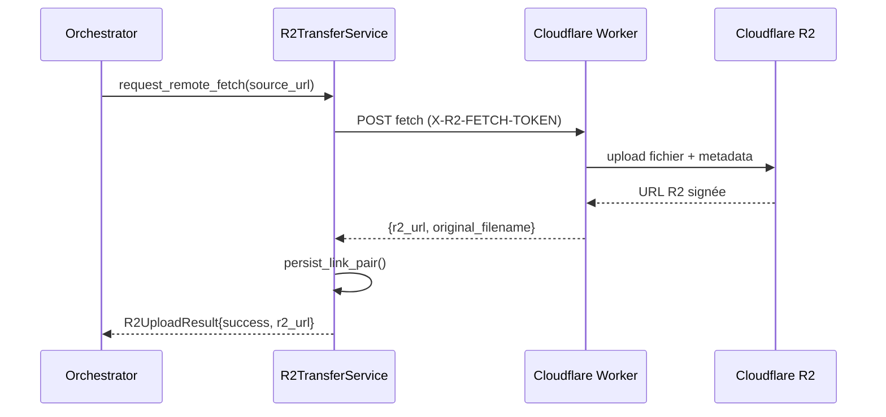

# Service R2TransferService - Offload Cloudflare R2

## Overview

Le `R2TransferService` est un service singleton responsable de l'offload automatique des fichiers volumineux (Dropbox, FromSmash, SwissTransfer) vers Cloudflare R2 afin d'économiser la bande passante Render (~$5/mois pour 50 GB).

## Architecture

### Service Singleton
- **Instance** : `R2TransferService.get_instance()`
- **Cache** : Persistance des paires `source_url`/`r2_url` dans `webhook_links.json`
- **Thread-safety** : Verrou `RLock` pour les écritures atomiques
- **Fallback** : Conservation des URLs sources si l'offload échoue

### Flux d'Offload



## Normalisation des URLs

### Stratégie par Fournisseur

#### Dropbox
- **Pattern** : `https://www.dropbox.com/(scl/)?[a-zA-Z0-9]+`
- **Timeout** : 120s pour les dossiers `/scl/fo/`, 30s par défaut
- **User-Agent** : Chrome moderne pour éviter les blocages
- **Validation** : Magic bytes ZIP pour les dossiers

#### FromSmash
- **Pattern** : `https://fromsmash.com/[a-zA-Z0-9]+`
- **Timeout** : 30s par défaut
- **Validation** : Taille minimale 1KB

#### SwissTransfer
- **Pattern** : `https://www.swisstransfer.com/[a-zA-Z0-9]+`
- **Timeout** : 30s par défaut
- **Validation** : Taille minimale 1KB

### Complexité
- **Fonction** : `normalize_source_url()` - Grade E (31)
- **Problème** : Multiples branches conditionnelles par fournisseur
- **Plan** : Implémentation Strategy Pattern pour réduire la complexité

## Configuration

### Variables d'Environnement (Obligatoires)
```bash
R2_FETCH_ENABLED=true
R2_FETCH_TOKEN=your-secret-token
R2_FETCH_ENDPOINT=https://your-worker.workers.dev
R2_BUCKET_NAME=render-signal-media
```

### Variables Optionnelles
```bash
R2_FETCH_TIMEOUT=30          # Timeout par défaut (secondes)
R2_DROPBOX_TIMEOUT=120      # Timeout spécifique Dropbox
R2_MAX_FILE_SIZE=104857600  # 100MB max par fichier
```

## API Service

### Méthodes Principales

#### `normalize_source_url(source_url: str) -> str`
Normalise l'URL selon le fournisseur avec validation des patterns.

#### `request_remote_fetch(source_url: str) -> R2UploadResult`
Envoie la requête au Worker Cloudflare pour l'offload.

#### `persist_link_pair(source_url: str, r2_url: str, provider: str, original_filename: str) -> None`
Persiste la paire de liens dans `webhook_links.json` avec déduplication.

#### `get_r2_url_for_source(source_url: str) -> Optional[str]`
Retourne l'URL R2 existante pour une source donnée (cache lookup).

### Types de Retour

```python
@dataclass
class R2UploadResult:
    success: bool
    r2_url: Optional[str] = None
    original_filename: Optional[str] = None
    error: Optional[str] = None
```

## Intégration Orchestrator

### Enrichissement des Payloads
L'orchestrator enrichit `delivery_links` avec les URLs R2 :

```python
# Avant
delivery_links = [
    {"provider": "dropbox", "raw_url": "https://www.dropbox.com/..."}
]

# Après offload R2 réussi
delivery_links = [
    {
        "provider": "dropbox", 
        "raw_url": "https://www.dropbox.com/...",
        "r2_url": "https://r2-url...",
        "original_filename": "document.pdf"
    }
]
```

### Logging
- **Succès** : `R2_TRANSFER: Successfully transferred <provider> link to R2 for email <email_id>`
- **Échec** : `R2_TRANSFER: Failed to transfer <provider> link: <error>`
- **Fallback** : Conservation de `raw_url` si échec (garantie de non-perte)

## Worker Cloudflare

### Endpoint
- **URL** : `POST /` (configuré via `R2_FETCH_ENDPOINT`)
- **Auth** : Header `X-R2-FETCH-TOKEN`
- **Payload** : `{"source_url": "...", "provider": "..."}`

### Métadonnées Stockées
- `originalFilename` : Extrait depuis `Content-Disposition`
- `provider` : Dropbox/FromSmash/SwissTransfer
- `expiresAt` : 24h par défaut
- `sourceUrl` : URL d'origine

### Sécurité
- Validation du token `X-R2-FETCH-TOKEN`
- Allowlist des domaines autorisés
- Taille maximale des fichiers
- Timeout configurable par provider

## Gestion des Erreurs

### Types d'Échec
1. **Configuration manquante** : `R2_FETCH_TOKEN` ou `R2_FETCH_ENDPOINT` absents
2. **Timeout** : Worker ne répond pas dans le délai imparti
3. **Fichier invalide** : Taille < 1KB ou magic bytes incorrects
4. **Erreur R2** : Échec de stockage dans le bucket

### Stratégie Fallback
- **Fail-closed** : Pas d'offload si configuration incomplète
- **Fail-graceful** : Conservation URLs sources si échec runtime
- **Logging** : Tous les échecs sont loggés avec contexte
- **Continuité** : Le flux webhook continue même si R2 échoue

## Performance et Coûts

### Économies
- **Bande passante** : ~$5/mois économisés pour 50 GB
- **Temps de chargement** : URLs R2 plus rapides que les originales
- **Fiabilité** : Cloudflare R2 plus disponible que les fournisseurs originaux

### Coûts R2
- **Stockage** : ~$0.015/GB/mois
- **Requêtes** : Négligeables pour le volume actuel
- **Egress** : Gratuit depuis Cloudflare Workers

## Monitoring

### Métriques
- Taux de succès par fournisseur
- Temps moyen de transfert
- Volume total offloadé
- Erreurs par type

### Logs Structurés
```
R2_TRANSFER: START - provider=dropbox source_url=...
R2_TRANSFER: SUCCESS - provider=dropbox r2_url=... size=12345
R2_TRANSFER: ERROR - provider=dropbox error=timeout
```

## Maintenance

### Nettoyage Automatique
- Rotation des liens anciens dans `webhook_links.json`
- Cleanup des métadonnées expirées dans R2

### Diagnostics
- Script de validation de la configuration R2
- Tests de connectivité avec le Worker
- Monitoring de l'espace utilisé dans le bucket

## Tests

### Tests Unitaires
- `tests/test_r2_transfer_service.py` : Service methods
- `tests/test_r2_resilience.py` : Scenarios d'échec

### Tests d'Intégration
- Mock Worker Cloudflare
- Validation end-to-end du flux
- Tests de timeout et retry

## Sécurité

### Tokens
- `R2_FETCH_TOKEN` secret partagé avec le Worker
- Rotation recommandée tous les 90 jours
- Stockage dans variables d'environnement

### Validation
- Allowlist stricte des domaines
- Taille maximale des fichiers (100MB)
- Validation des magic bytes pour les ZIP

---

*Dernière mise à jour : 2026-02-04*
